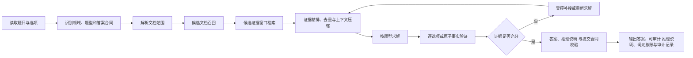

# 进阶教程与当前项目能力对比

> 本文档是项目的**长期能力地图**，只保留：答题链路、教程七个方向、能力细项、当前实现程度和稳定差距。
>
> 本文档不记录逐次执行过程、模型接口授权、全量运行或排行榜细节；稳定历史结论放在 docs/history/，新一轮临时任务由当轮工作区管理。

## 1. 文档用途

本文档用于回答三个问题：

1. 完整答题链路由哪些环节组成；
2. 教程七个方向分别包含哪些可落地的能力细项；
3. 后续执行包具体补哪一个能力缺口。

状态定义：

| 状态 | 含义 |
| --- | --- |
| 已实现 | 已进入生产主链，具备稳定实现 |
| 已实现基础能力 | 核心能力已进入主链，但仍需真实错题或生产效果继续校准 |
| 部分实现 | 已有模块，但质量、覆盖范围或生产闭环仍不足 |
| 部分实现（离线）/已实现离线底座 | 离线模块、审计或 A/B 底座已完成，但尚未获得生产接线授权 |
| 未实现 | 尚无可用实现 |
| 暂不优先 | 有价值，但当前比赛阶段不作为主线 |

## 2. 总体答题链路

### 2.1 一眼看懂版

```text
读题与识别题型
→ 确定候选文档范围
→ 召回相关文档
→ 检索关键证据
→ 精排、去重并压缩上下文
→ 按题型求解
→ 逐选项 / 原子事实验证
→ 缺证则补搜或重算
→ 格式校验并输出
```

本质上就是：

> **先判断题目要什么 → 找对文档和证据 → 得出答案 → 再验证一遍 → 合格后输出。**

### 2.2 详细闭环版



### 2.3 答题链路 × 七个方向能力细项映射

为了让“答题链”和“七个方向”真正对应起来，下面按答题步骤挂能力细项。一个能力可能同时服务多个步骤，因此这里是**主要归属关系**，不是唯一归属。

状态简写：`✅` = 已实现 / 已实现基础能力；`◐` = 部分实现 / 离线能力；`○` = 未实现 / 暂不优先。

#### ① 读题与识别题型

```text
题目 + 选项
→ 识别领域
→ 判断基础题型
→ 补充复合标签
→ 选择答案合同
→ 决定初始策略
```

主要能力细项：

- `D1-01 ✅` 基础题型识别：规则识别五类基础题型；
- `D1-02 ✅` 领域识别：按题目特征识别五大领域；
- `D1-03 ◐` 复合题型标签：叠加跨文档/计算/否定标签；
- `D1-04 ✅` 答案合同选择：按题型绑定对应输出格式；
- `D1-05 ◐` 策略路由：题型映射检索/求解/验证策略；
- `D1-06 ○` 低置信重分类：尚无统一置信度复判机制；
- `D4-02 ◐` 分题型预算：按题型分配上下文与输出预算；
- `D6-01 ✅` 分题型 提示词：按题型加载不同提示模板；
- `D7-02 ◐` 受控工具选择：题型决定检索/计算/验证工具。

当前已经具备的具体功能：**五领域识别、五类基础题型识别、答案输出规则 路由、题型专用 提示词、基础 求解器 路由**。当前主要缺口是“复合标签真正驱动下游策略”。

#### ② 确定候选文档范围

```text
题目实体 / 年份 / 产品 / 机构 / 报告类型
→ 生成候选文档范围
→ 记录候选范围血缘
```

主要能力细项：

- `D2-01 ✅` 语料完整性：校验文档数量、格式与非空；
- `D2-08 ◐` 来源可追溯：记录文档、页码与来源路径；
- `D3-01 ✅` 文档范围解析：无 `doc_ids` 自动生成候选文档；
- `D3-02 ◐` 查询词增强：抽取实体/年份/指标扩展查询；
- `D3-05 ◐` 跨文档召回：比较题保留多个必要文档；
- `D3-11 ✅` 检索范围血缘：记录候选范围到最终证据链；
- `D4-03 ✅` 候选/提示词 分离：宽召回后再收窄送模证据；
- `D7-01 ✅` 确定性工作流：固定状态机执行文档范围解析。

当前已经具备的具体功能：**盲检索评测 文档范围解析器、候选范围 / 必需范围分离、候选文档血缘、跨文档候选保留、无 `doc_ids` 自动进入范围解析器**。

#### ③ 召回相关文档

```text
候选文档范围
→ 词法 / 字段 / 结构信号召回
→ 多选题按选项补召回
→ 保留跨文档覆盖
```

主要能力细项：

- `D3-02 ◐` 查询词增强：查询计划 扩展检索关键词；
- `D3-03 ◐` 混合检索：融合词法/结构/字段/数值信号；
- `D3-05 ◐` 跨文档召回：多文档题保留完整目标集合；
- `D3-11 ✅` 检索范围血缘：记录请求、解析与实际命中文档；
- `D4-03 ✅` 候选/提示词 分离：先宽召回，再压缩送模范围；
- `D7-02 ◐` 受控工具选择：按领域选择对应检索路径。

当前已经具备的具体功能：**词法混合检索器、每选项补检索、文档范围审计、候选文档覆盖检查、查询计划 影子模式、数值/年份/标题等检索信号**。

#### ④ 检索关键证据

```text
已召回文档
→ 找章节 / 页 / 表格 / 指标
→ 形成候选证据窗口
→ 必要时同页解析器回退
```

主要能力细项：

- `D2-02 ◐` 阅读顺序与章节：保留标题、页码与章节层级；
- `D2-03 ◐` 表格解析：保留表头、行列、单位关系；
- `D2-04 ◐` 公式与数值：保留变量、公式、单位与精度；
- `D2-05 ◐` 扫描页处理：识别图片页与低质量文本层；
- `D2-06 ◐` 解析质量评分：标记稀疏页与解析异常页；
- `D2-07 ◐` 多解析器回退：MinerU 弱页同页切 PyMuPDF；
- `D2-08 ◐` 来源可追溯：文档+页码+来源路径定位；
- `D3-04 ◐` 结构感知检索：按章节/表格/指标定位目标页；
- `D3-06 ✅` 窗口扩展：命中点前后补充必要上下文；
- `D3-07 ✅` 证据精排：高价值窗口优先进入证据池；
- `D3-10 ◐` 受控纠错检索：按明确缺证项定向补搜；
- `D5-08 ◐` 跨文档一致性：按公司/年份/口径分别绑定。

当前已经具备的具体功能：**窗口检索、精确目标页检索、财报 目标页定位器、实体/年份/指标过滤、财务摘要/正式报表定位、MinerU 页级质量判断、同文档 + 同页的 PyMuPDF 回退、保留基线的候选证据增补**。

#### ⑤ 精排、去重并压缩上下文

```text
大量候选证据
→ 排序
→ 去重
→ 保留关键数字 / 公式 / 条件 / 否定
→ 压成模型真正需要的证据集
```

主要能力细项：

- `D3-07 ✅` 证据精排：按相关性筛高价值证据；
- `D3-08 ✅` 证据去重：合并重复与相邻证据窗口；
- `D3-09 ◐` 最小充分证据集：覆盖事实前提下压缩证据；
- `D4-01 ◐` 模型级 词元 估算：调用前估算上下文 词元；
- `D4-02 ◐` 分题型预算：按复杂度分配上下文预算；
- `D4-03 ✅` 候选/提示词 分离：候选宽、实际送模窄；
- `D4-04 ✅` 证据优先级：优先保留数字/公式/条件；
- `D4-05 ◐` 去冗余压缩：删除重复与低价值窗口；
- `D4-06 ○` 结构化摘要：尚未进入生产压缩链；
- `D4-07 ◐` 关键原文保护：保护数字/单位/否定/例外；
- `D4-08 ◐` 完成 词元 预留：提前预留推理输出空间；
- `D4-09 ◐` 调用前预算熔断：预计超限则阻断调用；
- `D4-10 ✅` 词元总账：累计逐题原始模型接口用量；
- `D7-06 ✅` 词元熔断：预算或异常触发安全停止。

当前已经具备的具体功能：**送模证据筛选、候选去重、关键数值/公式/否定保护、候选范围与送模范围分层、提示词预算、词元总账、最小充分证据集离线压缩底座**。

#### ⑥ 按题型求解

```text
压缩后的证据
→ 选择 求解器
→ 直接判断 / 多选判断 / 计算 / 抽取 / 跨文档比较
→ 生成候选答案与推理
```

主要能力细项：

- `D1-05 ◐` 策略路由：题型映射对应 求解器；
- `D5-07 ◐` 计算验证：公式变量绑定后 Python 复算；
- `D6-01 ✅` 分题型 提示词：按题型加载求解模板；
- `D6-03 ◐` 计算先公式：先抽变量公式再计算；
- `D6-07 ○` 少样本示例资产：尚无稳定可审计样例库；
- `D6-08 ◐` 离线 A/B 评估：冻结题集比较 提示词 版本；
- `D6-09 ◐` 模型适配：qwen3.7-plus 默认、qwen3.7-max 受控升级；
- `D6-10 ◐` 可审计推理：一次调用生成答案与推理；
- `D7-02 ◐` 受控工具选择：按题型选择求解工具；
- `D7-03 ◐` Python 计算：白名单公式确定性复算；
- `D7-07 ◐` 函数调用：统一暴露工具调用接口；
- `D7-08 ○` ReAct 智能体：暂不进入正式求解链；
- `D7-09 ○` 代码智能体：禁止任意代码生成执行。

当前已经具备的具体功能：**直接判断 / 多选 / 计算 / 自由文本 / 跨文档等求解器、Python 侧安全计算、公式变量规范化、题型提示词、模型级调用配置**。

#### ⑦ 逐选项 / 原子事实验证

```text
候选答案
→ 每个选项单独判断
→ 复杂选项拆成多个原子事实
→ 每个事实绑定证据
→ 检查支持 / 反驳 / 缺证
```

主要能力细项：

- `D2-08 ◐` 来源可追溯：验证结果回指文档与页码；
- `D3-11 ✅` 检索范围血缘：证据别名映射真实文档页；
- `D5-02 ◐` 逐选项判断：每个选项独立判支持/反驳；
- `D5-03 ◐` 原子事实拆分：拆主体/指标/时间/关系；
- `D5-04 ◐` 同源事实绑定：关键事实绑定同一局部证据；
- `D5-05 ◐` 反驳与否定：识别否定/条件/例外语义；
- `D5-06 ✅` 证据充分性：关键事实缺失则不放行；
- `D5-07 ◐` 计算验证：复核变量、单位与计算结果；
- `D5-08 ◐` 跨文档一致性：变量分别绑定各自文档口径；
- `D5-09 ✅` 不安全答案识别：阻断无证据与回退答案；
- `D5-12 ◐` 答案-推理一致性：推理必须支持最终答案；
- `D6-02 ◐` 逐选项 提示词：要求逐项输出判断与证据；
- `D6-04 ✅` 证据引用约束：输出引用可回溯证据编号；
- `D6-10 ◐` 可审计推理：推理包含事实、推导与结论。

当前已经具备的具体功能：**逐选项验证框架、证据充分性门槛、同源证据约束、短别名 → 标准文档 → 页码/来源 映射、计算复核、不安全回退答案阻断、失败即关闭放行**。当前仍在加强的重点是**原子事实、否定、条件、例外和 可见推理说明 的完整绑定**。

#### ⑧ 缺证则补搜或重算

```text
验证失败
→ 判断失败类型
→ 真缺证则补搜
→ 计算问题则重算
→ 血缘 / 绑定问题则修绑定
→ 服务商 / 预算 / 完整性问题则停止
```

主要能力细项：

- `D3-10 ◐` 受控纠错检索：仅真缺证才定向补搜；
- `D5-06 ✅` 证据充分性：判断关键事实是否齐全；
- `D5-07 ◐` 计算复算：变量绑定后确定性重算；
- `D5-10 ◐` 受控重新推理：按失败原因选择纠错动作；
- `D5-11 ✅` 最终放行仲裁：综合验证结果决定放行；
- `D4-08 ◐` 完成 词元 预留：预留纠错与输出空间；
- `D4-09 ◐` 调用前预算熔断：预算不足直接停止调用；
- `D4-10 ✅` 词元总账：所有调用统一累计对账；
- `D7-03 ◐` Python 重算：白名单计算确定性重跑；
- `D7-04 ◐` 有限轮纠错：限制补搜/重算次数；
- `D7-06 ✅` 词元熔断：预算或异常触发安全停止。

当前已经具备的具体功能：**证据充分性控制器、缺口驱动纠错基础、确定性计算复算、有限轮安全停止、词元熔断、运行完整性门槛**。当前主要缺口是把 `MISSING_EVIDENCE / LINEAGE_LOST / BINDING_FAILED / MODEL_ERROR` 等失败彻底分流，避免“什么失败都补搜或重试”。

#### ⑨ 格式校验并输出

```text
最终候选答案
→ 答案输出规则 校验
→ 答案与推理一致性检查
→ 词元 / 模型 / 调用链审计
→ 写出正式结果
```

主要能力细项：

- `D1-04 ✅` 答案合同选择：按题型确定最终输出格式；
- `D5-01 ✅` 输出格式验证：校验字母/数值/日期格式；
- `D5-11 ✅` 最终放行仲裁：证据与合同通过才输出；
- `D5-12 ◐` 答案-推理一致性：检查推理是否支持答案；
- `D6-05 ◐` 严格输出合同：解析并校验模型结构化输出；
- `D6-06 ◐` 提示词 版本管理：记录模板版本与参数；
- `D6-10 ◐` 可审计推理：输出关键事实、推导、结论；
- `D4-10 ✅` 词元总账：逐题记录并汇总原始 用量；
- `D7-01 ✅` 确定性工作流：固定流程执行最终写出；
- `D7-05 ✅` 状态保存与恢复：检查点 支持断点续跑；
- `D7-06 ✅` 词元熔断：异常或预算风险安全停止。

当前已经具备的具体功能：**答案输出规则、盲检索评测 `answer_1..answer_4` 输出结构、结果写出器、检查点 / 续跑、逐题词元总账、模型和运行审计、失败即关闭最终门槛**。当前硬缺口仍是**可见答案 + 推理说明的稳定输出，以及推理说明自包含质量**。

### 2.4 从七个方向反看答题链

| 七个方向 | 主要落在答题链哪些步骤 |
| --- | --- |
| D1 赛题题目类型分析 | ①读题识别 → ⑥按题型求解 → ⑨格式输出 |
| D2 PDF 解析方案 | ②文档范围 → ④关键证据检索 → ⑦证据验证 |
| D3 RAG 检索优化 | ②候选文档 → ③文档召回 → ④证据检索 → ⑤精排压缩 → ⑧补搜 |
| D4 上下文管理与动态记忆压缩 | ①策略预算 → ③候选/提示词 分层 → ⑤压缩 → ⑧预算控制 → ⑨词元总账 |
| D5 答案验证与多轮推理 | ⑥求解 → ⑦原子事实验证 → ⑧纠错 → ⑨最终仲裁 |
| D6 提示词工程 | ①分题型 提示词 → ⑥求解 提示词 → ⑦验证 提示词 → ⑨推理说明 / 输出合同 |
| D7 智能体化方向 | 横跨全链，重点是 ⑥工具选择 → ⑧有限纠错/安全停止 → ⑨状态恢复与审计 |

答题链不是七个方向的替代品。二者关系是：

- **答题链路**描述一道题从输入到输出经过什么环节；
- **七个方向**描述这些环节需要具备哪些系统能力；
- 一个方向可以影响多个答题环节，一个答题环节也可能依赖多个方向。

## 3. 七个方向总体能力表

| 编号 | 教程方向 | 主要影响的答题环节 | 当前状态 | 核心差距 |
| --- | --- | --- | --- | --- |
| D1 | 赛题题目类型分析 | 题目识别、策略路由、答案合同 | 部分实现 | 复合题型标签尚未稳定控制检索、预算、求解和验证策略 |
| D2 | PDF 解析方案 | 文档语料、结构与证据定位 | 部分实现 | 页/文档质量审计和双解析器离线校准已建立；财报当前更明确的缺口是先定位高价值目标页，再对 MinerU 缺表页做 选择性解析器回退，而不是全局切换解析器 |
| D3 | RAG 检索优化 | 文档召回、窗口检索、补搜 | 部分实现 | 文档范围解析已不再是当前主要阻断；财报真实缺口集中在 目标页 / 指标检索、随后才是 排序/筛选，低置信扩召回应保持受控 |
| D4 | 上下文管理与动态记忆压缩 | 证据组装、提示词预算 | 部分实现 | 候选范围与 送模范围已可分层收缩，最小充分证据离线效果明显；当前需按最新 词元审计规则用真实模型接口用量标定，不再假定 500k~5M 为固定满分平台 |
| D5 | 答案验证与多轮推理 | 事实核验、纠错、最终放行 | 部分实现 | 提示词内短别名 → 标准文档 → 页码/来源的血缘接口已具备基础能力；当前主链阻断转为 可见答案/推理说明输出规则与 真实运行绑定验证 |
| D6 | 提示词工程 | 求解、验证、结构化输出 | 部分实现 | Qwen3.7-plus / qwen3.7-max 均可进入正式模型链；重点转为稳定可见 JSON 输出，以及让推理说明在无外部上下文评分器下仍具备“关键事实 → 推导 → 结论”的自包含质量 |
| D7 | 智能体化方向 | 全链路编排、工具调用、恢复 | 部分实现但非当前主线 | 已有受控工作流，暂不建设大而全自主智能体平台 |

## 4. 七个方向的能力细项

后续优化任务应引用本节能力编号，例如 D3-07 + D4-03。只有形成稳定能力变化时才回填本文档；逐次执行过程不进入长期能力地图。

### 4.1 D1 赛题题目类型分析

| 细项编号 | 能力细项 | 目标能力 | 当前状态 | 稳定差距 |
| --- | --- | --- | --- | --- |
| D1-01 | 基础题型识别 | 区分单选、多选、判断、计算、抽取 | 已实现 | 需持续维护规则覆盖 |
| D1-02 | 领域识别 | 区分财报、合同、保险、监管、研报 | 已实现 | 边界题仍需置信度表达 |
| D1-03 | 复合题型标签 | 同时表达跨文档、计算、排序、比较、否定等特征 | 部分实现 | 当前标签粒度和组合能力不足 |
| D1-04 | 答案合同选择 | 根据题型选择字母、数值、日期、文本等输出合同 | 已实现 | 需与复合题型保持一致 |
| D1-05 | 策略路由 | 题型决定文档 Top-K、检索深度、预算、求解器和验证器 | 部分实现 | 分类结果尚未完整驱动下游策略 |
| D1-06 | 低置信重分类 | 识别分类不确定并触发受控复判 | 未实现 | 缺少统一置信度和复判协议 |

### 4.2 D2 PDF 解析方案

| 细项编号 | 能力细项 | 目标能力 | 当前状态 | 稳定差距 |
| --- | --- | --- | --- | --- |
| D2-01 | 语料完整性 | 原始文档与解析结果数量、格式、非空性可审计 | 已实现 | 继续保持语料校验 |
| D2-02 | 阅读顺序与章节 | 保留标题、段落、页码、章节层级和阅读顺序 | 部分实现 | 不同文档结构稳定性不一致 |
| D2-03 | 表格解析 | 保留表头、行列关系、单位和跨页表格 | 部分实现 | 复杂表格及跨页表仍可能失真 |
| D2-04 | 公式与数值 | 保留公式、变量、上下标、单位和精度 | 部分实现 | 公式异常缺少独立检测 |
| D2-05 | 扫描页处理 | 识别无文本层、低质量扫描和 OCR 异常 | 部分实现 | 缺少统一页级异常标签 |
| D2-06 | 解析质量评分 | 按文档和页输出可比较的质量分 | 部分实现（离线） | 已有文档/页风险审计；阈值仍需结合真实错题标定后才能影响生产 |
| D2-07 | 多解析器回退 | 主解析异常时切换备选结果 | 部分实现（离线） | 已完成 MinerU/PyMuPDF 同页校准和 回退候选标记；生产自动回退仍关闭 |
| D2-08 | 来源可追溯 | 证据可定位到文档、页码、章节、表格或块 | 部分实现 | 解析器 侧定位已增强，但 求解器/验证器 的最终 证据血缘 传播仍有断点 |

### 4.3 D3 RAG 检索优化

| 细项编号 | 能力细项 | 目标能力 | 当前状态 | 稳定差距 |
| --- | --- | --- | --- | --- |
| D3-01 | 文档范围解析 | 无 `doc_ids` 时生成候选文档范围 | 已实现 | 继续提升多文档完整召回率 |
| D3-02 | 查询词增强 | 从题目、选项、实体、年份、指标生成检索词 | 部分实现（影子模式已建立） | 统一查询计划与来源血缘已具备；独立 Top5 会回归，当前只允许保留基线后做低置信扩召回 |
| D3-03 | 混合检索 | 组合词法、结构、字段和规则信号 | 部分实现 | 当前基线排序更稳；查询计划 只能作为补充信号，权重和领域策略仍需真实错题标定 |
| D3-04 | 结构感知检索 | 利用章节、表格、页码和文档类型缩小范围 | 部分实现 | 已有结构信号和 解析器风险候选，但尚未稳定覆盖全部领域并接生产回退 |
| D3-05 | 跨文档召回 | 对比较、合并、排序题召回全部必要文档 | 部分实现 | 当前财报诊断样本中 候选文档已完整，主要缺口已下沉到目标财务页/指标页检索；后续重点从“继续扩文档”转为 面向文档的目标页定位器 |
| D3-06 | 窗口扩展 | 围绕命中位置补充必要上下文 | 已实现 | 扩展范围与成本需联动控制 |
| D3-07 | 证据精排 | 对候选窗口进行低成本二次排序 | 已实现基础能力 | 已有全局 送模证据筛选；下一步是用真实错题校准排序而非重建一套 重排器 |
| D3-08 | 证据去重 | 合并重复、相邻和语义等价证据 | 已实现基础能力 | 已有全局去重；仍需结合最小充分集和真实模型效果验证是否存在过度保留 |
| D3-09 | 最小充分证据集 | 在覆盖答案事实的前提下只保留必要窗口 | 部分实现（离线 晋级候选） | 04E 在 A/B 200 题实现稳定收缩且零新增覆盖/血缘回归；尚未接生产与真实模型接口 A/B |
| D3-10 | 受控纠错检索 | 证据不足时按明确缺口补搜，限制轮次和预算 | 部分实现 | 已有缺口/受控纠错基础；仍需把“真缺证”和“血缘/绑定 丢失”分流，避免错误补搜 |
| D3-11 | 检索范围血缘 | 候选文档到最终证据的范围传播可审计 | 已实现基础能力 | 已实现 提示词内 `DOC:n` → 标准文档 → 真实页码/来源 的确定性一对一映射与 失败即关闭 校验；仍需在稳定可见推理说明输出下完成真实运行绑定验证 |

### 4.4 D4 上下文管理与动态记忆压缩

| 细项编号 | 能力细项 | 目标能力 | 当前状态 | 稳定差距 |
| --- | --- | --- | --- | --- |
| D4-01 | 模型级 词元 估算 | 按实际模型保守估算中文 提示词 词元 | 部分实现 | 字符估算与真实模型消耗仍需标定 |
| D4-02 | 分题型预算 | 根据题型、领域和复杂度分配上下文及完成预算 | 部分实现 | 尚未由复合题型稳定驱动 |
| D4-03 | 候选范围与 送模范围分离 | 候选文档可较宽，实际送模证据必须二次收缩 | 已实现基础能力 | 当前 筛选器 已能从候选范围生成较窄 送模证据；04E 进一步提供最小充分集候选，待生产 A/B |
| D4-04 | 证据优先级 | 优先保留题目、选项、公式、数值、条件和例外条款 | 已实现基础能力 | 已有 选项/数值/公式/否定 等保护；仍需对真实错题验证优先级是否合理 |
| D4-05 | 去冗余压缩 | 删除重复原文、低价值窗口和无关背景 | 部分实现（离线增强） | 全局 筛选器 已去重，04E 可进一步大幅收缩；生产接线与模型质量回归尚未完成 |
| D4-06 | 结构化摘要 | 将可压缩内容转成带来源的结构化事实 | 未实现 | 暂不作为当前优先项，先完成可逆/可审计的证据选择与血缘闭环 |
| D4-07 | 关键原文保护 | 数字、公式、年份、单位、否定和例外条件不得被摘要损坏 | 部分实现（离线校验增强） | 04E 已保护 基线可见关键原文要求；真实模型接口下仍需验证不会因压缩损失答案质量 |
| D4-08 | 完成 词元 预留 | 在调用前为推理和输出预留明确预算 | 部分实现 | 预留策略未统一进入调用 门槛 |
| D4-09 | 调用前预算熔断 | 预计超预算时禁止调用并返回明确原因 | 部分实现 | 需与模型级估算完全接通 |
| D4-10 | 全流程词元总账 | 所有与最终提交相关的模型调用逐题累计并可核算 | 已实现基础能力 | 新赛制要求初答、验证、纠错、重试、推理说明生成等全部使用模型接口原始用量 入账，并与汇总严格一致 |

预算口径：

- 最新赛制明确要求逐题累计所有与最终提交有关的 模型接口原始用量，并对题目长度、推理说明信息密度、跨题词元分布和汇总一致性做审计；
- 最新规则中 `500,000 ~ 5,000,000` 段的 词元 效率公式存在文本歧义，项目不得再把该区间简单视为固定满分平台；
- 项目目标是完整真实申报，并优先通过“一次生成 答案 + 推理说明、减少无效重试和二次改写”控制成本；任何 用量 都必须来自允许模型/接口 的原始返回值。

### 4.5 D5 答案验证与多轮推理

| 细项编号 | 能力细项 | 目标能力 | 当前状态 | 稳定差距 |
| --- | --- | --- | --- | --- |
| D5-01 | 输出格式验证 | 校验选项顺序、数值、日期和文本格式 | 已实现 | 持续覆盖边界格式 |
| D5-02 | 逐选项判断 | 多选题分别判断每个选项的支持、反驳或缺证 | 部分实现 | 各领域证据结构仍不完全一致 |
| D5-03 | 原子事实拆分 | 将选项拆成主体、指标、时间、数值、单位、关系和极性 | 部分实现 | 原子字段完整性不足 |
| D5-04 | 同源事实绑定 | 关键原子必须来自同一文档和同一局部证据 | 部分实现 | 短别名 → 标准文档 → 页码/来源 的接口与离线回归已闭环；当前缺口是稳定拿到 可见推理说明 后验证 实时别名引用 与槽位/原子事实绑定全链一致 |
| D5-05 | 反驳与否定识别 | 区分支持、反驳、否定、例外和条件不成立 | 部分实现 | 否定与条件句仍需强化 |
| D5-06 | 证据充分性 | 缺少关键原子时保持未决，不强行放行 | 已实现 | 必须区分“检索真缺证”与“证据已给模型但 血缘 丢失”，后者不应误触发补搜或永久阻断 |
| D5-07 | 计算验证 | 校验变量、公式、单位、精度和结果 | 部分实现 | 公式规范化、Python 复算已增强；表格取数、变量来源与单位绑定仍需闭环 |
| D5-08 | 跨文档一致性 | 比较不同文档时绑定各自来源和时间口径 | 部分实现 | 跨文档计算结果可正确，但各变量来源必须逐一绑定到真实文档/页才能生产放行 |
| D5-09 | 不安全答案来源识别 | 阻断回退答案、无证据答案和越界来源 | 已实现 | 新 求解器 路径必须接入 |
| D5-10 | 受控重新推理 | 根据明确缺证项补搜或重新判断，限制轮次 | 部分实现 | 缺口到动作已有基础；下一步先按 `MISSING_EVIDENCE / LINEAGE_LOST / BINDING_FAILED / MODEL_ERROR` 分流 |
| D5-11 | 最终放行仲裁 | 综合求解器、验证器和输出规则结果决定接受或阻断 | 已实现基础能力 | 保留失败即关闭策略；血缘误阻断已通过 短别名接口显著收口，当前需把 `EMPTY_VISIBLE_OUTPUT / MODEL_OUTPUT_INVALID / PROVIDER_ERROR` 与证据类失败明确分流 |
| D5-12 | 答案-推理一致性 | 推理说明必须真实支持最终答案且与题目、证据、词元 申报一致 | 部分实现 | 推理说明 权重已提升到 30%，评分器只看推理说明文本；需要让摘要自包含关键事实/数值、必要推导和结论，同时避免跨题模板化与未申报二次改写 |

### 4.6 D6 提示词工程

| 细项编号 | 能力细项 | 目标能力 | 当前状态 | 稳定差距 |
| --- | --- | --- | --- | --- |
| D6-01 | 分题型 提示词 | 不同题型采用不同求解结构 | 已实现 | 复合题型模板仍需完善 |
| D6-02 | 逐选项 提示词 | 多选题要求逐项给出判断与证据 | 部分实现 | 输出结构与验证结构规范 需完全一致 |
| D6-03 | 计算先公式 | 先列变量、公式、单位，再计算结果 | 部分实现 | 需与计算验证器闭环 |
| D6-04 | 证据引用约束 | 回答必须关联明确文档和局部证据 | 已实现基础能力 | 提示词内 `DOC:n` 已可确定性映射到标准文档/页码/来源，并保持 未知/混合 失败即关闭；下一步主要是 真实运行可见推理说明 引用验证 |
| D6-05 | 严格输出合同 | 模型输出可稳定解析并满足答案输出规则 | 部分实现 | JSON/答案输出规则已有基础，但 服务商 偶发 `completion_tokens>0` 且 可见字段 `message.content` 为空；必须先稳定 可见答案+推理说明，再进入 全量 100 题 |
| D6-06 | 提示词注册与版本 | 模板、版本、模型、参数和变更原因可追踪 | 已实现离线底座 | 提示词注册表 已建立，生产注入 仍关闭，待真实 A/B 后再授权 |
| D6-07 | 少样本示例资产 | 示例按题型、领域和失败模式管理 | 未实现 | 尚无稳定、可审计样例集，当前优先级低于 证据血缘 闭环 |
| D6-08 | 离线 A/B 评估 | 同一冻结题集比较 提示词 版本 | 已实现离线底座 | 评测框架 已具备；尚未形成足够真实错误簇的 提示词 效果结论 |
| D6-09 | 模型适配 | 针对不同模型控制指令、上下文和输出 | 部分实现 | `qwen3.7-plus` 与 `qwen3.7-max` 均可进入正式链；应以 `qwen3.7-plus` 作为默认成本基线，`qwen3.7-max` 作为高难题/输出稳定性对照或受控升级，而不是无差别全量使用 |
| D6-10 | 可审计推理提示词 | 同一次模型输出同时生成答案与不少于 20 字的具体推理摘要 | 部分实现 | 推理说明占总分 30%，评分器仅看推理说明文本；提示词应显式要求自包含“关键事实/数值或条款 → 必要推导 → 结论”，并保持题间差异化 |

### 4.7 D7 智能体化方向

| 细项编号 | 能力细项 | 目标能力 | 当前状态 | 稳定差距 |
| --- | --- | --- | --- | --- |
| D7-01 | 确定性工作流 | 按固定状态机组织检索、求解、验证和写出 | 已实现 | 保持可预测、可审计 |
| D7-02 | 受控工具选择 | 根据题型选择检索、计算或验证工具 | 部分实现 | 工具选择仍以规则为主 |
| D7-03 | 受控 Python 计算 | 对计算题执行白名单计算逻辑 | 部分实现 | 需扩大公式与单位覆盖 |
| D7-04 | 有限轮纠错 | 证据不足时执行有限次数补搜和重算 | 部分实现 | 退出条件和预算需统一 |
| D7-05 | 状态保存与恢复 | 中断后可续跑，不重复覆盖已完成结果 | 已实现 | 新流程需持续遵守 |
| D7-06 | 词元熔断与安全停止 | 达到预算、异常或证据风险时停止 | 已实现 | 报告与运行状态必须保持一致 |
| D7-07 | 函数调用 接口 | 以标准接口暴露检索、计算和验证工具 | 部分实现 | 尚未统一所有工具协议 |
| D7-08 | 通用 ReAct 智能体 | 模型自主规划多步工具调用 | 暂不优先 | 比赛阶段成本和不确定性较高 |
| D7-09 | 通用 代码智能体 | 模型生成并执行任意代码解决问题 | 暂不优先 | 安全、审计和收益不适合当前主线 |

## 5. 横向生产约束

以下约束不单独属于某一个教程方向，但所有生产执行包都必须遵守：

| 编号 | 横向约束 | 要求 |
| --- | --- | --- |
| X-01 | 无 `doc_ids` 输入 | 系统必须自动生成并传播候选文档范围 |
| X-02 | 血缘一致 | 检索器、证据组装器、求解器、验证器 使用范围必须可核对；重点保证 提示词内证据引用能解析回真实文档/页码/来源 |
| X-03 | 生产 失败即关闭 | 正式 生产正式放行 必须在证据、合同、预算和运行完整性全部通过后放行；不能为减少阻断直接关闭安全 门槛 |
| X-04 | 词元预算 | 真实完整申报；最新 500k~5M 段公式存在文本歧义，不按固定满分平台处理；优先一次生成答案+推理说明并减少无效重试，不得漏报、估算或人为凑词元 |
| X-05 | 可恢复执行 | 检查点、总账、用量 和结果文件支持续跑与对账 |
| X-06 | 零重复付费 | 同一实验不得因恢复或并行错误重复调用同一 qid |
| X-07 | 提交隔离与完整性 | 实验产物、候选提交文件和正式上传文件职责分离；任何上传提交文件必须 100/100 qid 完整且满足官方答案输出规则 |
| X-08 | 完整审计 | 每次真实调用可追踪模型、词元、输入范围、结果和停止原因 |
| X-09 | 探索基线分层 | 工程探索结果与正式提交来源必须隔离；Qwen3.7/3.6/3.5 允许模型的历史结果也只有在 推理说明、逐题用量、调用链和后处理均可审计时才可复用，不能因模型家族合法就自动升级为正式来源 |
| X-10 | 模型、推理说明与提交审计 | 正式提交必须满足允许模型/接口、`answer_1..answer_4` 9 列 CSV、推理说明自包含质量、逐题全部调用原始用量、`total` 等式与汇总一致性 |

## 6. 执行包引用规则

后续评估者派发任务时，应写明：

```text
目标链路节点：例如“证据精排 → 上下文压缩”
目标能力编号：例如 D3-07、D3-08、D4-03
要解决的稳定差距：引用本文档对应描述
验收标准：由本次派单文件 单独定义
明确不做：防止执行包范围扩张
```

本文档只在以下情况更新：

1. 新增或删除一项长期能力；
2. 项目主链已经稳定具备某项能力，需要调整能力状态；
3. 教程、赛制或总体架构发生变化；
4. 某项长期差距的定义发生变化。

单次执行者完成、评估者复评、小规模验证 或 全量 100 题 结果，不直接写入本文档。

## 7. 文档职责边界

- docs/reference/对比计划.md：长期能力地图。
- docs/history/CURRENT_STATE_20260725.md：封箱时的稳定能力快照。
- docs/history/PARALLEL_TASK_CONCLUSIONS_20260725.md：已删除比赛工作区的结论级历史。
- 新一轮优化产生的临时任务和运行产物默认不进入长期仓库，待能力稳定后再更新代码、测试和本文档。
